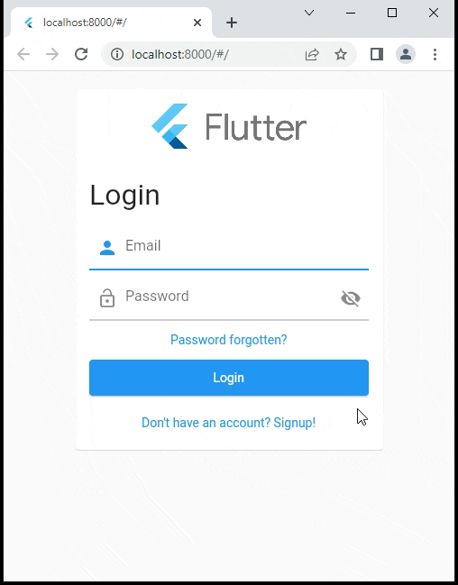

# flutter_login_simple

A basic login for Firebase Authentication by email.

Handles the UI and Firebase Authentication in the background. It has to be initialized with:

- Image logo
- Callback function on succesful login
- Privacy HTML
- Terms of Service HTML

The callback receives user data (`uid`, `email`, ...). It also allows for calls like `user.logout()` and `user.delete()`.

In case the user is aready logged in, the user the suceess-login callback function will be called.

**Run the example**

The example directory contains a working Flutter app. Add your Firebase config before running it: `lib/firebase_options.dart`.

Make sure to enable Firebase Authentication for Email in the Firebase Console. Forgetting to do so is a common pitfall.



## Outlook

Add more login options and potentially theming.

## Installation

`flutter pub get flutter_login_simple`

## Basic usage

Please refer to the complete [example](example/example.md). 


```dart
// Your logo
Image logo = Image.network(
    'https://storage.googleapis.com/cms-storage-bucket/c823e53b3a1a7b0d36a9.png');


// Your callback will get executed on successful login.
onLoginSuccess(UserSessionData user) {
    Navigator.push(
      context,
      MaterialPageRoute(builder: (context) 
        => LoginSuccessPage(user)),
    );
}

// Your Terms of Service
String htmlToc = '<h1>Terms of Service</h1>';

// Ypur Privacy Policy
String htmlPrivacy = '<h1>Privacy Policy</h1>';

return LoginStarter(logo, onLoginSuccess, htmlToc, htmlPrivacy);
```

Accessing the returned `UserSessionData`:

```dart
user is UserSessionData;

print(user.uid);
print(user.email ?? 'not given');
print(user.displayName ?? 'not given');
// ... and so on with all properties

// void return !
await user.logoutUser(); 

bool isSuccess = await user.deleteUser();

// The original Firebase Authentication user
// for other use cases.
var firebaseUser = user.firebaseUser();
```

## Bugs and Requests

If you encounter any problems feel free to open an issue. Pull request are also welcome.

https://github.com/xErik/flutter_login_simple/issues

## License

This project is licensed under the MIT License - see the [LICENSE](LICENSE) file for details